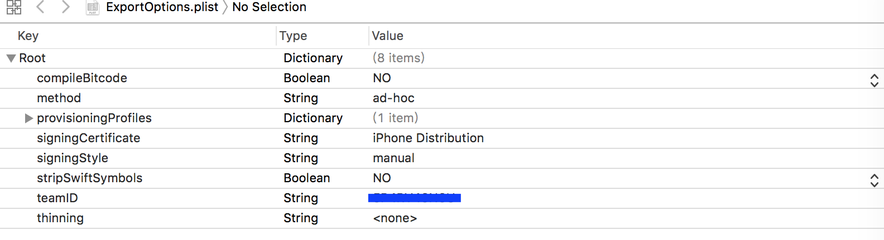

# iOS 发布工具

### Install

python 2.7

```
pip install ipublish
```

### Require
1. Xcode 9.0

2. 创建 `ExportOptions.plist` 文件`[Require]`  
	在工程的根目录创建一个`ExportOptions.plist`文件，下图是 	`ExportOptions.plist` 的一个例子，你可以根据自己的情况去修改
	
	
	
	你也可以使用`Xcode`手动构建，在导出的`ipa`文件同目录下，你会发现生成的`ExportOptions.plist`文件，然后拷贝到工程根目录，就可以一劳永逸。

### Quick Start

1. __publish__

	快速体验
		
	```
	cd /path/of/your/ios/project
	publish
	```
	
2. __发布到fir.im__
	
	添加 __fir.im__ 的 __api_token__
	* 如果你想上传到你的fir.im账户上，你需要在[fir.im](fir.im)账户上拿到你的`api_token`，然后把它添加到程序中
	
		```
		publish-fir api_token
		```
	* 你也可以直接编译项目，程序依然会记录你的`api_token`，就像这样
	
		```
		publish -f api_token
		# or
		publish --fir api_token
		```
		
	以上两种方式任选一种，之后的操作，你只需要在你的工程根目录下执行就可以了
	
	```
	publish
	```
	
	如果你需要更新你的fir.im 的api_token，
	
	```
	publish-fir api_token
	```
	
3. __发布到蒲公英__
	
	[蒲公英](https://www.pgyer.com/doc/view/api)平台的操作，基本和fir.im是一样的，同样是添加蒲公英的__api_key__
	
	```
	publish-pgy api_key
	# or
	publish -p api_key
	# or
	publish --pgy api_key
	```
	
4. __发布到自己服务器__
	
	如果你希望发布到自己的服务器，你需要自己写上传脚本，然后像下面这样，目前只支持`python` 上传
	
	```
	publish --upload script.py
	```
	当然同一目录下，程序依然会记录你的上传脚本，所以后面的操作，你依然可以使用以下命令上传到自定义服务器。
	
	```
	publish
	```
	这里有一个自定义服务器的上传脚本例子，你可以参考[upload.py](./upload.py)
	
5. __发布顺序__

	1. 默认上传，即不加参数编译上传
		
		```
		publish
		```
		* 程序默认优先上传自定义服务器，如果你使用过自定义服务器的上传脚本，并且目录下有上传文件的话。
		* 其次会上传到 fir.im 平台，如果不满足自定义服务器上传的条件，并且你程序级路过你 fir.im 账户的`api_token`。
		* 如果前面两个上传条件都不满足，程序会选择蒲公英平台上传，当然在这之前程序必须记录了你的蒲公英账户的`api_key`。
		* 如果以上条件统统不满足，当然不会上传。
	
	2. __选择上传__
	
		选择上传的前提是程序之前记录过上传相关的信息，如果你满足所有的上传条件，但是不想选择默认的上传方式。
		
		```
		publish -f	#上传到fir.im，程序中必须记录过 api_token
		# or
		publish -p	#上传到蒲公英，程序中必须记录过 api_key
		```
		为了保证自定义上传的顺利进行，如果你要选择自定义上传，必须传入脚本文件
		
		```
		publish --upload upload.py	#上传自定义平台
		# or
		publish
		```
6. __仅导出__
	
	如果你不想发布到任何服务器，只是导出`ipa`，你可以尝试下面的操作
	
	```
	publish -b
	```

